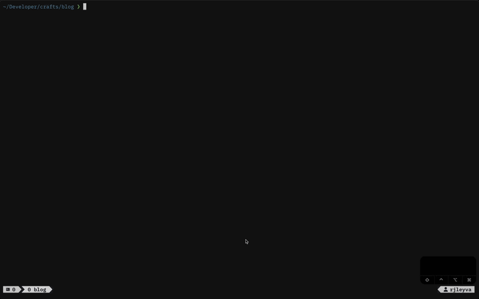

# RJ dotfiles-macos - Editor Workflow 🌴

## NOTE: Outdated Media / TODO

Some of the GIFs and plugin references in this guide are no longer up to date with my current configuration.
I plan to update them in due course when time allows.

### Current TODOs

- [ ] Replace outdated GIFs.
- [ ] Remove references to plugins no longer in use (e.g., fzf.nvim, noice.nvim, nvim-notify).
- [ ] Update keymap examples to reflect current workflow.
- [ ] Add new GIFs showing minimal Neovim + tmux workflow.
- [ ] Review and streamline text to remove obsolete plugin notes.

The core concepts of this workflow remain valid, but some examples may differ from my latest setup.

## File Management

At this stage I prefer to keep file management straightforward by using Neovim’s built-in `netrwPlugin`. When I type
`:Ex` (short for `Explore`), it opens a directory view that allows me to move through folders directly inside Neovim.

Creating a new file is equally simple. I place the cursor on the directory where I want the file to live and press `%`.
Neovim then prompts me to provide a file name, and once I confirm with `<Enter>` the file immediately opens in a new
buffer, ready for editing.

I could map a shortcut to toggle `netrwPlugin` more quickly:

```lua
-- Toggle netrw with \
vim.keymap.set("n", "\\", function()
  local netrw_open = false

  -- Check all buffers for a netrw buffer
  for _, buf in ipairs(vim.api.nvim_list_bufs()) do
    if vim.api.nvim_buf_is_loaded(buf) and vim.api.nvim_buf_get_name(buf):match("NetrwTreeListing") then
      netrw_open = buf
      break
    end
  end

  if netrw_open then
    -- Close the netrw buffer
    vim.api.nvim_buf_delete(netrw_open, { force = true })
  else
    -- Open netrw
    vim.cmd.Ex()
  end
end, { desc = "Toggle netrw file explorer" })
```

Alternatively, you can open `netrw` in a vertical split on the left, styled more like modern side-panel explorers such as
`neo-tree`:

```lua
-- Toggle netrw in a vertical split (like neo-tree) with \
vim.keymap.set("n", "\\", function()
  local netrw_buf = nil

  -- Find if a netrw buffer is already open
  for _, buf in ipairs(vim.api.nvim_list_bufs()) do
    if vim.api.nvim_buf_is_loaded(buf)
      and vim.api.nvim_buf_get_name(buf):match("NetrwTreeListing") then
      netrw_buf = buf
      break
    end
  end

  if netrw_buf then
    -- Close netrw buffer
    vim.api.nvim_buf_delete(netrw_buf, { force = true })
  else
    -- Open netrw in a vertical split on the left
    vim.cmd("Vexplore")
    -- Move it to the far left
    vim.cmd("wincmd H")
    -- Resize the width like neo-tree
    vim.cmd("vertical resize 30")
  end
end, { desc = "Toggle netrw file explorer" })
```

and you can configure `netrwPlugin` defaults in `options.lua` so it behaves more like a modern file explorer:

```lua
-- Netrw defaults to behave like a modern file explorer
vim.g.netrw_banner = 0        -- Hide the top banner
vim.g.netrw_liststyle = 3     -- Tree-style listing
vim.g.netrw_browse_split = 0  -- Reuse the same window
vim.g.netrw_winsize = 30      -- Default width
vim.g.netrw_altv = 1          -- Always open splits on the right (when triggered inside netrw)
```

## Keeping It Minimal

In the past I relied on plugins such as `statusline.nvim` and `lualine.nvim`, along with several custom keymaps, to manage
tabs and window splits in Neovim. With time I realised that tmux already provided everything I needed for panes, splits
and navigation, so I decided to shift that part of my workflow there.

For example, this is how I once configured window and tab management in Lua:

```lua
-- Window management
vim.keymap.set("n", "<leader>wv", "<C-w>v", { desc = "Split window vertically" })
vim.keymap.set("n", "<leader>wh", "<C-w>s", { desc = "Split window horizontally" })
vim.keymap.set("n", "<leader>we", "<C-w>=", { desc = "Equalize split sizes" })
vim.keymap.set("n", "<leader>wx", "<cmd>close<CR>", { desc = "Close current split" })

-- Tab management
vim.keymap.set("n", "<leader>to", "<cmd>tabnew<CR>", { desc = "Open new tab" })
vim.keymap.set("n", "<leader>tx", "<cmd>tabclose<CR>", { desc = "Close current tab" })
vim.keymap.set("n", "<leader>tn", "<cmd>tabn<CR>", { desc = "Go to next tab" })
vim.keymap.set("n", "<leader>tp", "<cmd>tabp<CR>", { desc = "Go to previous tab" })
vim.keymap.set("n", "<leader>tf", "<cmd>tabnew %<CR>", { desc = "Open current buffer in new tab" })
```

These days I keep Neovim focused on editing while `tmux` handles the terminal, windows and panes. Giving each tool a clear
role keeps the overall setup lean, reduces duplication, and helps the workflow remain straightforward and dependable.



### Trouble.nvim, the Simple Way

When I first discovered `trouble.nvim`, I leaned on it quite heavily and thought it was essential to my workflow.
With time, however, I came to realise that I was only making use of a small portion of its features.

Rather than keeping a full interface plugin for those few tasks, I now make use of Neovim’s built-in diagnostics with a
few carefully chosen keymaps. This provides everything I need, including quick navigation, floating windows, and the
option to send results to the quickfix or location lists, while keeping the overall setup lean and responsive.

```lua
function M.diagnostics()
  vim.keymap.set(
    'n',
    '[d',
    vim.diagnostic.goto_prev,
    { desc = 'Diagnostics: Prev' }
  )
  vim.keymap.set(
    'n',
    ']d',
    vim.diagnostic.goto_next,
    { desc = 'Diagnostics: Next' }
  )

  vim.keymap.set(
    'n',
    '<leader>xq',
    vim.diagnostic.setqflist,
    { desc = 'Diagnostics: Quickfix' }
  )
  vim.keymap.set(
    'n',
    '<leader>xl',
    vim.diagnostic.setloclist,
    { desc = 'Diagnostics: Location List' }
  )

  vim.keymap.set(
    'n',
    '<leader>xf',
    vim.diagnostic.open_float,
    { desc = 'Diagnostics: Float' }
  )

  vim.keymap.set('n', '<leader>xd', function()
    if vim.diagnostic.is_disabled(0) then
      vim.diagnostic.enable(0)
      vim.notify 'Diagnostics enabled (buffer)'
    else
      vim.diagnostic.disable(0)
      vim.notify 'Diagnostics disabled (buffer)'
    end
  end, { desc = 'Diagnostics: Toggle Buffer' })

  vim.keymap.set('n', '<leader>xt', function()
    local current = vim.diagnostic.config().virtual_text
    vim.diagnostic.config { virtual_text = not current }
    vim.notify('Diagnostics virtual text: ' .. (current and 'OFF' or 'ON'))
  end, { desc = 'Diagnostics: Toggle Virtual Text' })
end
```

I also adopted a small quality-of-life improvement I first came across in
`[folke/lazyvim](https://www.lazyvim.org/configuration/general)`. It allows me to close certain special buffers safely
with a single key, in this case `<q>`. This keeps the experience consistent and avoids accidentally disrupting other
parts of the session.

```lua
  -- close certain buffers with <q>, safely
  vim.api.nvim_create_autocmd('FileType', {
    group = vim.api.nvim_create_augroup('close_with_q', { clear = true }),
    pattern = {
      'PlenaryTestPopup',
      'checkhealth',
      'dbout',
      'gitsigns-blame',
      'help',
      'lspinfo',
      -- 'neotest-output',
      -- 'neotest-output-panel',
      -- 'neotest-summary',
      'notify',
      'qf',
      'spectre_panel',
      'startuptime',
    },
    callback = function(event)
      vim.bo[event.buf].buflisted = false
      vim.keymap.set('n', 'q', function()
        if vim.fn.winnr '$' > 1 then
          vim.cmd 'close'
        else
          vim.cmd 'bdelete'
        end
      end, { buffer = event.buf, silent = true })
    end,
  })
```

This way, I retain the core functionality I once relied on most from `trouble.nvim`, but in a lighter and more
straightforward manner.


## Keeping It Native

In my earlier setup, `noice.nvim` quickly became a favourite. Its polished command line, clear workspace messages
(such as catching when same LSP attaches more than once), and smooth interface made everyday work feel effortless.

For this stage of my configuration, however, I chose to remain with Neovim’s native interface. Part of that choice was
a matter of discipline, learning to rely less on overlays and more on built-in tools such as `:checkhealth lsp`. At the
same time, I also revisited how I manage my LSP setup. Previously I depended on `nvim-lspconfig`, which is an excellent
plugin and taught me a great deal when I was starting out. Yet with Neovim 0.11+, manual LSP configuration has
become much simpler, and adopting it has given me finer control whilst keeping the environment lean.

I still hold `noice.nvim`, `nvim-lspconfig`, `mason`, and `lazydev` in high regard, and I may well return to them in the
future. For now, my focus is on fewer plugins, less maintenance, and more time spent learning JavaScript and React.


## Parting ways with nvim-notify

Since stepping away from `noice.nvim`, I also chose to part with `nvim-notify`. Both are beautifully designed plugins
that bring a great deal of polish to Neovim’s interface, and I thoroughly enjoyed using them in my previous setup. I
still regard them as excellent tools.

For this iteration, though, I wanted to explore how far I could go with Neovim’s built-in features. After some
experimentation, I found that configuring diagnostics with virtual text provided the immediate feedback I needed, without
introducing another interface layer. It feels simpler, more lightweight, and aligns with my aim of keeping the setup as
close to native as possible.

Here’s how I configure diagnostics to display with virtual text and signs:

```lua
-- Diagnostics
-- NOTE: Configure how diagnostics (errors, warnings, etc.) are displayed.
-- virtual_lines and virtual_text can be tuned based on personal preference.
vim.diagnostic.config {
  virtual_lines = true,
  virtual_text = true,
  underline = true,
  update_in_insert = false,
  severity_sort = true,

  float = {
    border = 'rounded',
    source = true,
  },

  signs = {
    text = {
      [vim.diagnostic.severity.ERROR] = '󰅚 ',
      [vim.diagnostic.severity.WARN] = '󰀪 ',
      [vim.diagnostic.severity.INFO] = '󰋽 ',
      [vim.diagnostic.severity.HINT] = '󰌶 ',
    },
    numhl = {
      [vim.diagnostic.severity.ERROR] = 'ErrorMsg',
      [vim.diagnostic.severity.WARN] = 'WarningMsg',
    },
  },
}
```

I also set up a small keymap that allows me to toggle virtual text diagnostics on and off whenever I need.

```lua
vim.keymap.set('n', '<leader>xd', function()
  if vim.diagnostic.is_disabled(0) then
    vim.diagnostic.enable(0)
    vim.notify 'Diagnostics enabled (buffer)'
  else
    vim.diagnostic.disable(0)
    vim.notify 'Diagnostics disabled (buffer)'
  end
end, { desc = 'Diagnostics: Toggle Buffer' })
```

I may return to `nvim-notify` or `noice.nvim` in the future, as they remain excellent plugins, but for the moment I value
the simplicity of keeping everything native.


